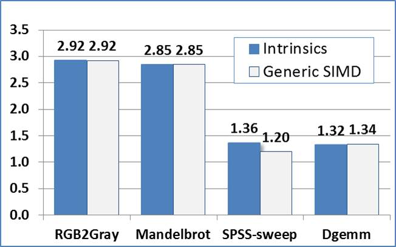
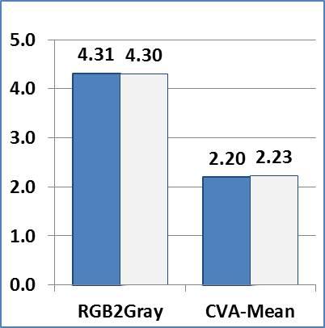
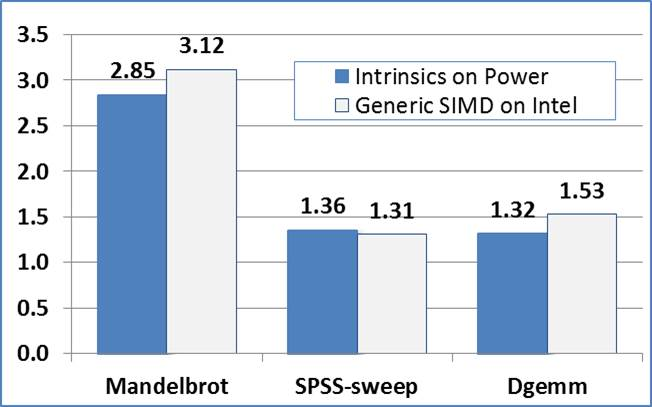
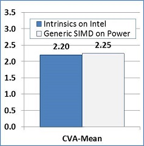

#Performance Data
 
 
##Performance Evaluation

The performance goal of the generic SIMD intrinsic library is to match up with the performance of the same code written in a platform-specific intrinsics. We have ported some examples from intrinsics implementation to Generic SIMD implementation, and evaluated their performance.

Applications include

- RGB2Gray, float
- Mandelbrot, float
- SPSS-sweep, double
- Dgemm, double
- CVA-Mean, float

Some of them only have Power Platform intrinsics implementation, and some of them only have intel intrinsics implementation.  We compared the generic SIMD's performance with the intrinsics implementation by measure their speed up over scalar code.

We also evaluated the portability of our Generic SIMD intrinsics library by running the generic SIMD version application on the platform without intrinsics implementation.

Below are the result.

The following figures show the performance speedup versus the scalar code on different platforms.

Higher is better.

__App on Power Platform__  

__App on Intel Platform__   

__App with Power Intrinsics only__   

__App with Intel Intrinsics only__   
